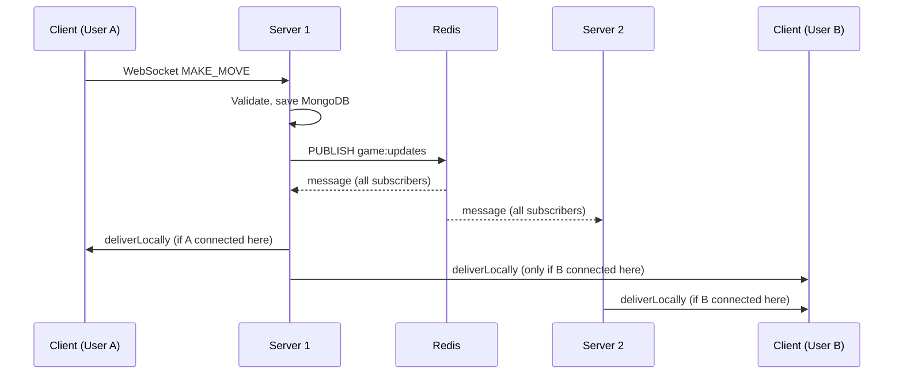

# Redis Pub/Sub — Realtime Game Events

This document describes how **cross-server WebSocket delivery** works in this codebase: the data model, Redis roles, startup order, and what happens on each machine when a move or matchmaking event occurs.

---

## Why Pub/Sub?

Each API process keeps an in-memory map `userId → WebSocket` (`src/ws/store.ts`). If you run **more than one** Node process behind a load balancer, a player might be connected to **Server B** while their opponent’s HTTP/WebSocket request is handled on **Server A**. Broadcasting only from `userSockets` on the server that handled the write would miss users on other instances.

**Redis Pub/Sub** is a lightweight event bus: one server **publishes** a message after the database is updated; **every** subscribed process (including the publisher’s own process) receives a copy and forwards it only to **local** sockets for the target user IDs.

Persistence is still **MongoDB**; Redis here does **not** store game state for replay—it only carries ephemeral “push this to these users” instructions.

---

## Redis connections (`src/config/redis.ts`)

The app uses **three** separate `node-redis` clients, all pointing at the same Redis server:

| Client   | Role |
|----------|------|
| `redis`  | Data structures: matchmaking queue (`LPUSH` / `LPOP`), etc. |
| `pub`    | **Publish only** — `PUBLISH` to channels. |
| `sub`    | **Subscribe only** — `SUBSCRIBE` and receive messages. |

**Why not one client for everything?** In the Redis protocol, a connection that enters **subscriber mode** is dedicated to receiving pub/sub messages and should not be used for normal commands on the same connection. Using `duplicate()` gives isolated connections so queue operations, publishing, and subscribing do not block each other.

---

## Channel and message shape

- **Channel name:** `game:updates` (constant `GAME_REALTIME_CHANNEL` in `src/pubsub/gameRealtime.ts`).
- **Payload:** A single JSON string whose parsed value is an **envelope**:

```json
{
  "deliveries": [
    { "userId": "<mongo user id string>", "payload": { } },
    { "userId": "<mongo user id string>", "payload": { } }
  ]
}
```

Each `payload` is whatever the WebSocket client already expects (`GAME_STARTED`, `MOVE_MADE`, `GAME_OVER`, etc.). Using **per-user** entries allows white and black to receive **different** bodies for the same logical event (for example `GAME_STARTED` includes each player’s color).

---

## Single code path: publish → subscribe → local send

Game logic **does not** call `userSockets.send` for shared realtime events anymore. It only calls `publishDeliveries` (`src/services/game.ts`, `src/ws/emitters.ts`).

Flow:

1. **Write path:** Service validates input, updates MongoDB (game document, move document, etc.).
2. **Publish path:** `publishDeliveries` serializes the envelope and runs `pub.publish("game:updates", body)`.
3. **Redis** pushes the message to every connection that has subscribed to `game:updates` on that Redis instance (all app processes in the deployment).
4. **Subscribe path:** On each process, the `sub` client’s listener runs. It parses JSON, validates `deliveries`, then calls `deliverLocally`.
5. **Local delivery:** For each `{ userId, payload }`, the code looks up `userSockets.get(userId)` and, if the socket is **open**, sends `JSON.stringify(payload)`.

Because the **same** process that handled the HTTP/WebSocket “make move” also subscribes, that process receives its **own** publish and delivers to both players if both sockets are attached there. If players are split across processes, each process delivers only to users present in **its** `userSockets` map—so nobody is missed.



---

## Startup order (`src/index.ts`)

Order matters:

1. `connectMongo()` — persistence available.
2. `connectRedis()` — all three clients connected.
3. `startGameRealtimeSubscriber()` — **`sub` subscribes** before accepting gameplay traffic that might publish.
4. `initWSServer(server)` — WebSocket server attaches to the HTTP server.
5. `server.listen(...)` — bind port.

If the subscriber started **after** clients could publish, you could theoretically miss early messages; serializing bootstrap avoids that race for normal restarts.

---

## Failure behavior

- **`publishDeliveries`** wraps `pub.publish` in try/catch. If publish fails (Redis down, network blip), it logs and calls **`deliverLocally`** with the same `deliveries`. That means users **on this process** still get updates, but **other instances** will not until Redis is healthy again—consistent with Redis Pub/Sub being best-effort and not durable.

- The subscriber registers **`sub.on("error", ...)`** so connection issues are logged; `node-redis` may reconnect depending on configuration.

---

## Relation to the matchmaking queue

- **List queue** (`redis` client): atomic matchmaking (`LPUSH` / `LPOP`-style usage in `src/services/matchmaking.ts`).
- **Pub/Sub** (`pub` / `sub`): broadcast “game started” and all in-game realtime notifications after state is committed.

They are complementary: queue finds pairs; pub/sub fans out the result and ongoing moves to the right processes.

---

## Files to read in the repo

| File | Responsibility |
|------|------------------|
| `src/config/redis.ts` | Three Redis clients |
| `src/pubsub/gameRealtime.ts` | Channel name, publish, subscribe, `deliverLocally` |
| `src/services/game.ts` | `publishDeliveries` after moves / resign |
| `src/ws/emitters.ts` | `publishDeliveries` after a new game is created |
| `src/ws/store.ts` | `userSockets` map for local delivery |

---

## Interview-style summary

- **MongoDB** = source of truth for games and moves.
- **Redis list** = matchmaking queue (atomic pairing).
- **Redis Pub/Sub** = fan-out of “notify these user IDs” to every Node process; each process sends only to its own WebSockets.
- **No cross-server socket sharing** — only messages and IDs cross Redis; sockets stay local to each process.
